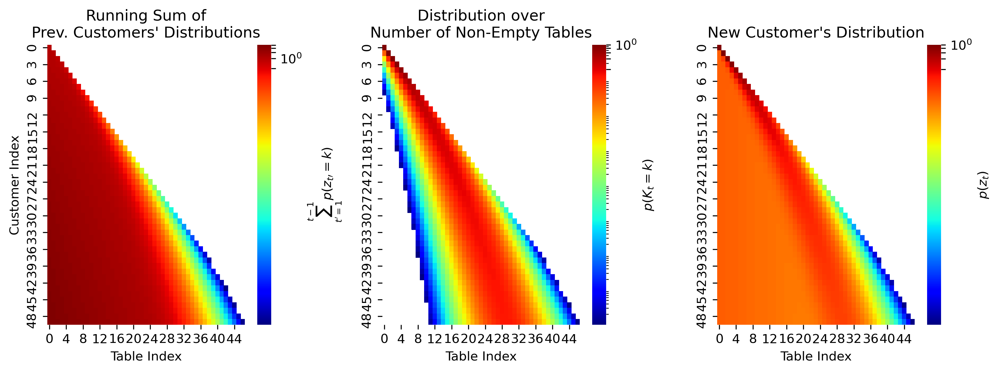

# Efficient Online Inference for Nonparametric Mixture Time Series

This code corresponds to our [UAI 2021](https://proceedings.mlr.press/v161/schaeffer21a/schaeffer21a.pdf) paper.
In this paper, we provide an efficient streaming inference algorithm
for infinite mixture models using a novel Bayesian recursion on the Chinese
Restaurant Process.

To make streaming inference possible, we break the CRP's conditional distribution
$$p(z_t|z_{<t}, \alpha)$$ on the complete history by replacing it with a marginal 
distribution $$p(z_t|\alpha)$$. The running sum of the previous marginal distributions 
$$\sum_{t' < t} p(z_{t'} = k)$$ (left) and the Chinese restaurant table distribution 
$$p(K_{t-1} = k)$$ (middle) compete to determine the next marginal distribution 
$$p(z_t = k)$$ (right). Note the logarithmic scaling.

## Setup

After cloning the repository, create a virtual environment for Python 3:

`python3 -m venv rcrp`

Then activate the virtual environment:

`source rcrp/bin/activate`

Ensure pip is up to date:

`pip install --upgrade pip`

Then install the required packages:

`pip install -r requirements.txt`

We did not test Python2, but Python2 may work.

## Running

Each experiment has its own directory, each containing a `main.py` that creates a `plots`
subdirectory (e.g. `exp_00_crp_prior/plots`) and then reproduces the plots in the paper. Each 
`main.py` should be run from the repository directory e.g.:

`python3 exp_00_crp_prior/main.py`

## Contact

Questions? Comments? Interested in collaborating? Open an issue or 
email Rylan Schaeffer at rylanschaeffer@gmail.com and cc Ila Fiete at fiete@mit.edu.
