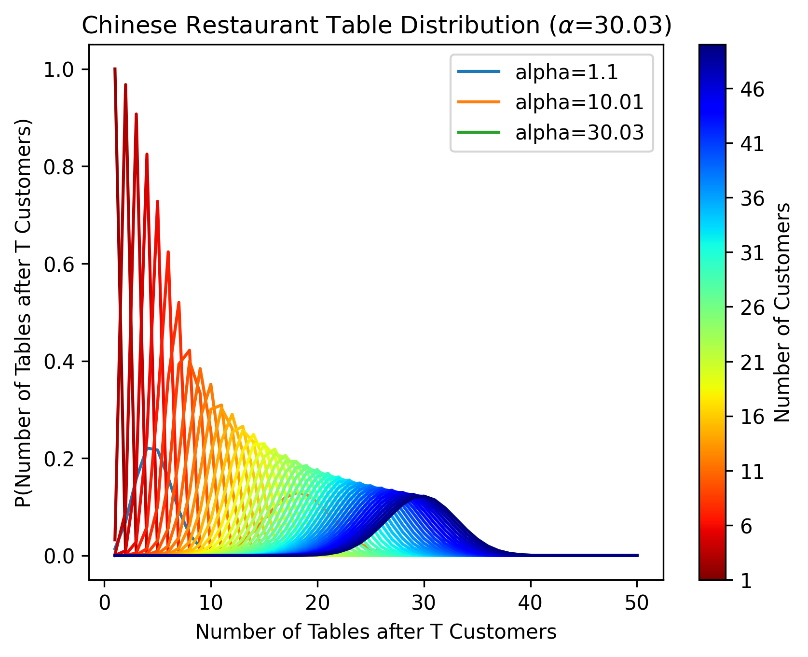

# Online Inference in Chinese Restaurant Process Latent Variable Time Series

## Setup

After cloning the repository, install the requirements. The requirements are quite basic
(numpy, matplotlib), so you may be able to skip this step.

`pip install -r requirements.txt`

We used Python3 and did not test Python2, but Python2 may work.

## Running

Each experiment has its own directory, each containing a `main.py` that creates a `plots`
subdirectory (e.g. `exp_00_prior/plots`) and then reproduces the plots in the paper. Each 
`main.py` should be run from the repository directory e.g.:

`python3 exp_00_prior/main.py`

## Contact

Questions? Comments? Interested in collaborating? Open an issue or 
email Rylan Schaeffer at rylanschaeffer@gmail.com and cc Ila Fiete at fiete@mit.edu.